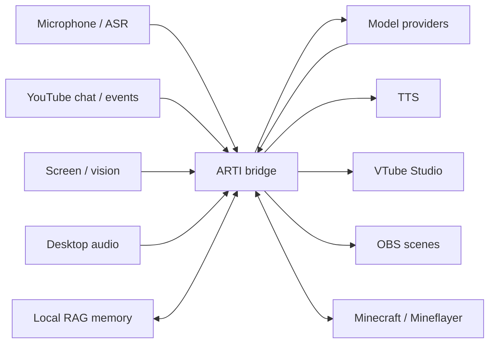

# ARTI — AI VTuber co-host

ARTI is an experimental AI VTuber co-host built to hang out on livestreams: it can listen, read chat, use screen context and memory, speak back through TTS, drive a VTuber/OBS setup, and play Minecraft through a Mineflayer bridge.

**Website:** [artiberarti.com](https://artiberarti.com)  
**Docs:** [`docs/README.md`](docs/README.md) · **Wiring:** [`docs/WIRING.md`](docs/WIRING.md) · **Minecraft:** [`docs/MINECRAFT-SETUP.md`](docs/MINECRAFT-SETUP.md)

ARTI is an active project rather than a polished one-click app. Start with the main bridge, then enable only the integrations you actually want to configure.

## Quick start

### Requirements

- Windows 10/11 for the main bridge setup documented here.
- Python 3.11.
- Node.js only if you want the Minecraft integration.
- Credentials and optional desktop apps only for the providers/features you enable, such as VTube Studio or OBS Studio.

### Run the main bridge

1. Clone the repository and create a Python 3.11 virtual environment.
2. Install the main Python dependencies:

   ```bash
   python -m pip install -r requirements.txt
   ```

3. Copy the public templates to their local runtime names:

   ```text
   .env.example                   -> .env
   config_local.json.example      -> config_local.json
   ARTI_SOUL.example.md           -> ARTI_SOUL.md
   ARTI_VIEWERS.example.md        -> ARTI_VIEWERS.md
   ARTI_MOOD_STATE.example.json   -> ARTI_MOOD_STATE.json
   ```

4. Fill in only the providers and features you intend to use. Keep real credentials, viewer data, and personal runtime state local.
5. Start ARTI:

   ```bash
   python hermes_vtuber_bridge.py
   ```

For feature-specific setup, continue with [`docs/WIRING.md`](docs/WIRING.md). Minecraft has its own setup in [`docs/MINECRAFT-SETUP.md`](docs/MINECRAFT-SETUP.md).

## What ARTI can do now

| Area | Public runtime |
|---|---|
| Voice | Microphone ASR, optional desktop-audio transcription, and TTS output. |
| YouTube | Read live chat and route configured stream/event inputs into ARTI's response flow. |
| Screen / vision | Use optional screen/context scouting with supported vision-provider wiring. |
| Memory / RAG | Keep long-term context through the local RAG layer while leaving the real memory vault out of Git. |
| VTuber / OBS | Drive VTube Studio expressions or motion and switch configured OBS scenes. |
| Minecraft | Run a Mineflayer-based player through the `mc-bot/` bridge. |

Optional integrations are only meant to be treated as available when they are explicitly documented and configured. Provider availability, pricing, and free-tier limits can change independently of this repository.

## How the pieces fit together



The bridge is the center of the public runtime. Your real character files, credentials, viewer data, session memory, local paths, and application-specific setup remain local.

## Setup guides

- [`docs/WIRING.md`](docs/WIRING.md) — providers, YouTube chat, TTS, local memory, VTube Studio, OBS, and other bridge wiring.
- [`docs/MINECRAFT-SETUP.md`](docs/MINECRAFT-SETUP.md) — install and run the Mineflayer integration.
- [`docs/README.md`](docs/README.md) — index of the public documentation that ships with this repository.

## Experimental and intentionally not shipped

ARTI mixes ordinary software checks with hardware- and application-dependent integrations, so the evidence is kept deliberately specific:

- **UNIT_TESTED / CLOUD_VERIFIED** means deterministic or cloud-safe tests passed without the creator's local streaming setup.
- **LOCAL_VERIFIED / VERIFIED LIVE** is reserved for separately recorded real-world validation. Cloud CI is not live proof.
- Microphones, audio devices, GPUs, VTube Studio, OBS, and live game sessions still need local verification on the machine running them.
- The Stardew Valley integration is not included in this public repository release.
- Undocumented or gated integrations should be treated as experimental, not as shipped features.

Public release notes live in [`CHANGELOG.md`](CHANGELOG.md).

## Minecraft

The Minecraft integration is split between Python orchestration and the Node/Mineflayer player in `mc-bot/`. Install its dependencies separately:

```bash
cd mc-bot
npm ci
```

Then follow [`docs/MINECRAFT-SETUP.md`](docs/MINECRAFT-SETUP.md). Public CI checks this path deterministically; it does not claim a live Minecraft world or server session.

## Privacy and public distribution

This repository is a curated public distribution of ARTI. It ships runtime code, public-safe examples, selected documentation, and tests; private/local runtime state stays out of Git.

Keep these local:

- API keys, tokens, `.env`, and real `config_local.json` values;
- viewer profiles, transcripts, stream/session logs, donation/chat captures, and private RAG databases;
- VTube Studio tokens, runtime telemetry, machine-specific paths, and private character/session files.

If a fixture cannot be shown to be synthetic or public-safe, do not publish it. See [`SECURITY.md`](SECURITY.md) for vulnerability reporting and disclosure guidance.

## Tests

Public/cloud-safe validation runs through GitHub Actions. Useful local-safe checks include:

```bash
python scripts/public_reference_check.py
python scripts/public_privacy_scan.py
python -m pytest -q
python -m compileall -q .
```

Hardware/application integrations are intentionally outside public cloud CI.

## Contributing

See [`CONTRIBUTING.md`](CONTRIBUTING.md) for the contributor workflow and [`AGENTS.md`](AGENTS.md) for repository-safe agent guidance. Keep new examples synthetic, make optional integrations fail closed, and distinguish cloud evidence from real-world validation.

## License

See [`LICENSE`](LICENSE).
