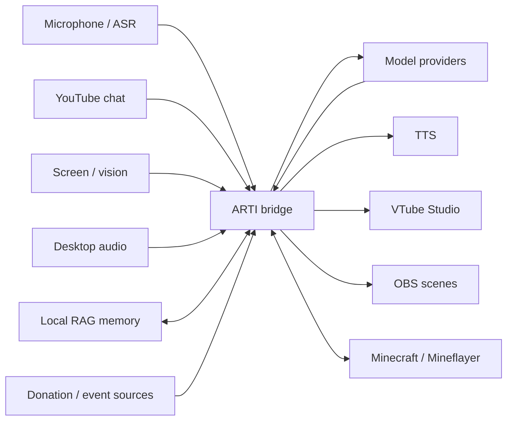

# ARTI — VTuber AI co-host

ARTI is an experimental AI co-host for livestreams. It combines microphone and desktop-audio input, YouTube chat, screen context, memory, donations, a VTuber avatar, OBS scene control, and game integrations behind one Python bridge.

**Website:** https://artiberarti.com  
**Public docs:** [`docs/README.md`](docs/README.md)  
**Minecraft setup:** [`docs/MINECRAFT-SETUP.md`](docs/MINECRAFT-SETUP.md)

This repository is the **curated public distribution** of ARTI. It contains product/runtime code, public-safe examples, selected documentation, and tests. Private stream transcripts, viewer data, local configuration, telemetry, development handoffs, and other working-repository material are intentionally not published.

## What ARTI can do

- Hear the streamer through ASR and react in near-real time.
- Read YouTube live chat and route replies through configurable model providers.
- Use optional screen/vision context and desktop-audio transcription.
- Keep long-term memory through a local RAG layer while keeping the actual private vault out of Git.
- Drive VTube Studio expressions/motion and switch OBS scenes.
- React to supported donation/event sources.
- Run as a Minecraft player through the Mineflayer bridge in `mc-bot/`.
- Use optional/experimental integrations that are explicitly documented and gated.

## How the pieces fit together



The public repository provides the runtime and wiring; your real character files, credentials, viewer data, session memory, local paths, and application-specific setup remain local.

## Status and verification language

ARTI is an active project, not a polished one-click application. Features are intentionally described by the strongest evidence actually available:

- **UNIT_TESTED / CLOUD_VERIFIED** means deterministic or cloud-safe tests passed without requiring the creator's local streaming setup.
- **LOCAL_VERIFIED / VERIFIED LIVE** is reserved for separately recorded real-world evidence. Cloud CI must not be treated as live proof.

The September 2, 2026 public refresh is sourced from the frozen private product baseline `f61f2e21ca1f66eaa8e73520cf384d9c767a9ae6`. Later private development, including OBS-2B2a terrain work, is not part of this release.

## Requirements

- Python 3.11
- Node.js for the Minecraft Mineflayer component
- Optional external applications depending on features used: VTube Studio, OBS Studio, Minecraft
- Provider/API credentials for whichever model, ASR, vision, or donation integrations you enable

Platform-specific features can have additional requirements. Hardware- and local-application integrations are not exercised by public cloud CI. Provider availability, pricing, and free-tier limits can change independently of this repository.

## Setup

1. Clone this repository and create a Python 3.11 virtual environment.
2. Install the dependencies you need:

   ```bash
   python -m pip install -r requirements.txt
   ```

3. Copy the public examples instead of editing secrets into tracked files:

   ```text
   .env.example                   -> .env
   config_local.json.example      -> config_local.json
   ARTI_SOUL.example.md           -> ARTI_SOUL.md
   ARTI_VIEWERS.example.md        -> ARTI_VIEWERS.md
   ARTI_MOOD_STATE.example.json   -> ARTI_MOOD_STATE.json
   ```

4. Fill only the providers/features you intend to use. Keep real credentials and personal data local.
5. Run the bridge:

   ```bash
   python hermes_vtuber_bridge.py
   ```

For feature-specific setup, continue with [`docs/WIRING.md`](docs/WIRING.md).

The examples are placeholders. Never commit `.env`, real `config_local.json`, VTube Studio tokens, private memory/vault files, transcripts, or runtime logs.

## Minecraft

The Minecraft integration is split between Python orchestration and a Node/Mineflayer player in `mc-bot/`. Install its dependencies separately:

```bash
cd mc-bot
npm ci
```

See [`docs/MINECRAFT-SETUP.md`](docs/MINECRAFT-SETUP.md) for the full wiring. Minecraft checks in public CI are deterministic/cloud-safe checks only; they do not claim a live game/server session.

## Stardew Valley

The Stardew Valley integration remains **REVIEW** for this public refresh and is **not included** in the September 2 export. Its private runtime, SMAPI projects, telemetry, fixtures, and verification material stay outside this repository, and no Stardew test result is claimed by this release. PR #25 / OBS-2B2a terrain work is also outside the frozen source baseline.

## Documentation

Start with [`docs/README.md`](docs/README.md). The public documentation covers:

- bridge/provider/VTube Studio wiring;
- Minecraft setup;
- observer, scouter, and vision architecture;
- VTube Studio animation and expression/motion behavior;
- public-safe behavior specs and smoke-test notes.

Internal implementation queues, private handoffs, raw research archives, and live-session evidence are intentionally not mirrored here.

## Tests

Public/cloud-safe validation is run through GitHub Actions where available. Typical local-safe commands are:

```bash
python -m pytest -q
python -m compileall -q .
```

Minecraft has additional deterministic Node checks when exposed by `mc-bot/package.json`. Tests requiring a real microphone, audio device, GPU, VTube Studio, OBS, Steam, Stardew Valley, or a live Minecraft world are outside cloud CI.

## Privacy and repository hygiene

The public repository deliberately excludes internal development choreography and private runtime state. In particular, do not add:

- API keys, tokens, credentials, `.env`, or real local configuration;
- viewer profiles, transcripts, stream/session logs, donation/chat captures, or private RAG databases;
- debug dumps, screenshots, raw telemetry, machine paths, or backup locations;
- internal handoffs, Control Tower material, task queues, raw research archives, or private fine-tuning data.

If a fixture cannot be proven synthetic/public-safe, do not publish it.

## Contributing

See [`CONTRIBUTING.md`](CONTRIBUTING.md) for the normal contributor workflow and [`AGENTS.md`](AGENTS.md) for repository-safe agent guidance. Keep new examples synthetic, make optional integrations fail closed, and distinguish unit/cloud evidence from real-world validation.

## License

See [`LICENSE`](LICENSE).
