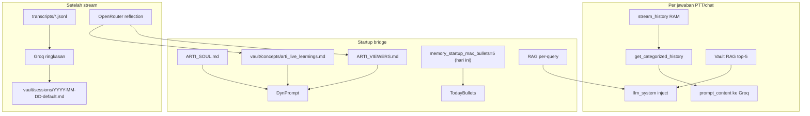

# Audit Memori & Vault Arti — Juni 2026

Tanggal audit: 2026-06-04 (implementasi plan `emotion_verify_memory_audit`)

## Verdict singkat

**Sistem memori ada dan arsitektur benar**, tapi **kualitas data** (noise, thinking leak, RAG stale) membuat Arti terasa “nggak ingat” meski infrastruktur jalan.

| Aspek | Skor | Catatan |
|-------|------|---------|
| Arsitektur 3-lapis | ✅ Bagus | RAM tipis + RAG per-query + reflection post-stream |
| Kualitas data vault | ⚠️ Diperbaiki | Thinking leak disanitasi; learnings dipangkas 60 bullet |
| Recall live (RAG) | ⚠️ Ditingkatkan | Recency boost hari ini / 7 hari |
| Viewer di prompt | ⚠️ Diperbaiki | Blok viewer dipangkas terakhir |

---

## Arsitektur memori (3 lapis)

| Lapisan | Kapasitas | Fungsi |
|---------|-----------|--------|
| **stream_history** | ~50 baris RAM | Konteks menit terakhir |
| **Vault RAG live** | 1729 chunk embedded (Jun 2026) | Recency boost + shutdown reindex 90s |
| **arti_live_learnings** | max 60 bullet (append) | Ditulis post-stream; startup inject 5 bullet **hari ini** |
| **ARTI_VIEWERS.md** | ~15 viewer | Profil untuk trigger YT |

---

## Perbaikan yang diimplementasikan

### 1. Sanitasi ringkasan Groq (`session_transcript.py` + `arti_memory_quality.py`)

- Strip blok ``, ``, `<think>`
- `/no_think` di user message untuk model qwen
- Session MD 2026-06-14/16/17 dibersihkan (script `scripts/prune_vault_memory.py`)

### 2. Learning quality gate (`arti_memory_quality.py`)

- Skip: terlalu pendek, `"tidak ditemukan"`, duplikat fuzzy
- **Append** di bawah (bukan prepend), cap 60 bullet
- Dipakai oleh `arti_openrouter._append_learning` dan `save_long_term_memory`

### 3. Prune learnings

- Backup: `archive/vault-prune-2026-06-17/`
- Rebuild: `python scripts/prune_vault_memory.py --rebuild`
- Reindex RAG: `python arti_vault_rag.py --reindex-all` (butuh LM Studio embedding server)

### 4. Recall live

- `arti_vault_rag.py`: recency boost +0.15 (hari ini), +0.08 (≤7 hari)
- `memory_startup_max_bullets: 5` — hanya bullet `[YYYY-MM-DD]` hari ini

### 5. System prompt trim (`trim_system_prompt_for_llm`)

- Hapus blok per-section (bukan truncate tail)
- Urutan pangkas: summarizer → memori → RAG → **viewer terakhir**

---

## Checklist tes memori (manual)

1. **RAM:** Sebut sesuatu di PTT → tanya lagi dalam 2 menit → harus referensi history
2. **Hari ini:** "Tadi kita tes emotion apa?" → jawab bingung/marah/sedih (dari learnings/RAG hari ini)
3. **Viewer:** Viewer regular trigger → panggil nama + konteks dari `ARTI_VIEWERS.md`
4. **Vault bersih:** Session MD baru tanpa blok thinking
5. **RAG:** Query "expression emotion Param130" → chunk 2026-06-16/17, bukan hanya June 5

---

## Checklist smoke test emotion (manual — user)

Restart VTS + bridge, lalu PTT tiga mood:

| Mood | Harus |
|------|-------|
| **bingung** | nod + mulut gerak + lampu (Param130) |
| **marah** | nod + lampu + mulut |
| **sedih** | lampu + mulut, **tanpa** nod (`[Nod] skip (mood: sedih)`) |

Log: `debug-f4ed86.log` (`runId: emotion-fix`), terminal `[Expr] mood:` / `[Nod]`.

Perintah eksplisit contoh: *"Arti coba muka sedih"* / *"muka marah"* / *"muka bingung"*.

---

## Post v0.5.8 (2026-06-20)

- `python scripts/prune_vault_memory.py --rebuild --all-sessions` — backup `archive/vault-prune-YYYY-MM-DD/`
- `python arti_vault_rag.py --reindex-all` — butuh LM Studio embedding
- `python scripts/vault_health.py` — cek sebelum/sesudah stream
- CONFIG: `vault_rag_reindex_on_shutdown: True`, timeout **90s**
- Index: **1729** chunk, **0** unembedded; session `2026-06-20-default.md` ter-index

---

- Prune learnings: selalu backup dulu ke `archive/`
- Reindex butuh LM Studio embedding server (`lmstudio_embedding_base_url`)
- Jangan commit tanpa diminta user
