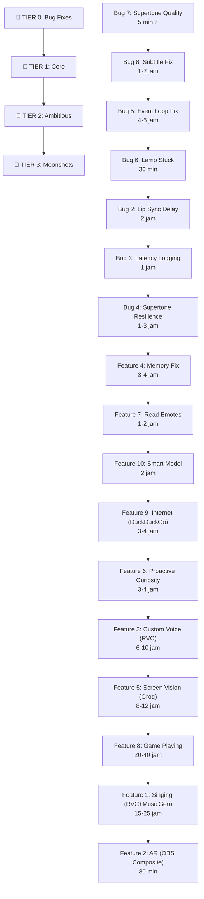

# 🎮 ARTI VTUBER v0.6+ — MEGA ROADMAP (DEEP RESEARCH EDITION)

> **v0.5 is PERFECT. This plan is about what comes NEXT.**
> Based on: livestream malam 1 Juni 2026 (5186 lines log, 118 responses, 93 YT chat triggers, ~1 jam stream)
> Updated: 1 Juni 2026 21:48 WIB — with deep open-source research from 3 parallel agents

---

## 📊 Stream Health Report (from log analysis)

| Metric | Value | Assessment |
|--------|-------|------------|
| Total Arti responses | 118 | ✅ Very active |
| Groq API calls | 119 (rolling counter reached 239) | ✅ Healthy |
| YT Chat triggers | 93 | ✅ Great engagement |
| Echo suppressions | 82 | ⚠️ High — may indicate VB-Cable routing issue |
| `attached to different loop` errors | **73** | 🔴 Async event loop bug |
| `Task was destroyed but pending` | **103** | 🔴 WebSocket connection leak |
| `Event loop is closed` | **9** | 🔴 Loop lifecycle bug |
| Rate limit hits (Groq) | **25** | ⚠️ Expected at high volume |
| Supertone timeouts | **2** (both `TimeoutError`) | ⚠️ Triggered edge_tts fallback |

> [!WARNING]
> **Biggest Technical Debt**: The idle animation system spawns new threads that create their own event loops, causing 73+ "different loop" errors per session. These silently break motion tracking. This is the #1 stability fix needed.

---

## 🐛 TIER 0 — BUG FIXES (Do First)

### Bug 1: ~~Animasi titik 3 + lampu mati~~ ✅ DONE

---

### Bug 2: Lip Sync Delay saat Motion Aktif

**Root Cause (from code audit):**
- Lip sync is 100% driven by VTS's built-in audio detection (virtual cable → VTS mic input)
- Bridge sets `tts_is_playing = True` at playback start, which pauses idle motions
- **BUT**: There's an async gap — during TTS synthesis time (Groq API + Supertone/edge_tts), `tts_is_playing` is still `False`, so motions CAN fire
- When a motion is mid-play as audio starts, VTS may need a moment to re-prioritize lip sync over motion keyframes

**Fix approach:**
```
Opsi A: Set tts_is_playing = True EARLIER — saat API call mulai, bukan saat audio play
Opsi B: Add a "pre-speech" state yang stop motions saat Arti "mikir"
Opsi C: Both — gabungin "mikir" state + earlier flag
```

**Effort:** ~2 jam
**Risk:** Low

---

### Bug 3: Minimalisir Overall Delay

**Current latency chain (unmeasured, estimated):**
```
Mic detection → ASR (Groq Whisper, ~1-3s)
    → LLM API call (Groq, ~1-5s depending on model)
        → TTS synthesis (Supertone ~2-5s / edge_tts ~1-3s)
            → Audio playback start
                → VTS lip sync detection (~50-100ms)
TOTAL ESTIMATED: 5-15 seconds end-to-end
```

**Fix approach (multi-pronged):**

| Optimization | Impact | Effort |
|-------------|--------|--------|
| **Add latency logging** (measure each step) | 📊 Diagnostic — must do FIRST | 1 jam |
| **TTS streaming** — start playback as first chunk arrives | -2-4s | 4-6 jam |
| **Shorter prompts** — trim system prompt bloat | -0.5-1s | 1 jam |
| **Model selection** — pin to fastest Groq model (llama-3.1-8b-instant) for chat | -1-2s | 30 min |
| **Parallel TTS prep** — init Supertone while LLM streams | -1-2s | 3 jam |

> [!IMPORTANT]
> **Step 1 is adding latency logging.** We literally have ZERO timing data right now. Can't optimize what we can't measure.

**Effort:** 2-10 jam (depending on how many optimizations)
**Risk:** Medium — TTS streaming is the hardest part

---

### Bug 4: Supertone Fallback ke Edge TTS

**From log analysis:**
- Line 4245: `[TTS] Supertone failed (TimeoutError: ); fallback ke edge_tts`
- Line 4423: Same — happened twice in 1 session
- Both triggered during high-activity periods (many rapid chat triggers)
- Streamer noticed: `[20:31:56] "Suaranya diganti lagi."` and `[20:32:05] "banyak banget errornya"`

**Root cause:** Supertone subprocess has 20-second synthesis timeout. Under CPU pressure (multiple async tasks + VTS + OBS), synthesis exceeds ceiling → `TimeoutError` → auto-fallback to edge_tts.

**Fix approach:**

| Fix | Impact | Effort |
|-----|--------|--------|
| **Increase timeout** from 20s → 30s | Prevents premature fallback | 5 min |
| **Auto-retry Supertone** once before fallback | Catches transient failures | 30 min |
| **Log Supertone synthesis time** per utterance | Diagnostic | 30 min |
| **Priority CPU affinity** for Supertone subprocess | Reduces CPU contention | 1 jam |
| **Reduce total_steps** from 8 → 6 during high-load | Faster synthesis at slight quality cost | 30 min |

**Effort:** 1-3 jam
**Risk:** Low

---

### Bug 5: Event Loop / Thread Leak

**This is the elephant in the room.** 73 "different loop" errors + 103 "Task destroyed" warnings per session.

**Root cause:** `idle_timer_thread` spawns new threads with `asyncio.run()`, creating NEW event loops. But VTS WebSocket connections from previous threads aren't closed properly, and shared `asyncio.Lock` objects are bound to the old loop.

**Fix approach:**
- Stop creating new threads for each idle cycle — reuse a single dedicated thread/loop
- Properly close WebSocket connections when idle thread restarts
- Use `threading.Lock` instead of `asyncio.Lock` for cross-thread resources

**Effort:** 4-6 jam
**Risk:** Medium — touches core animation system

---

### Bug 6: Lampu/Nametag Stuck 45 Menit

**Symptom:** The "emblem" (nametag lamp above Arti's head) turned on and stayed on for ~45 minutes straight. Viewer noticed at `[19:50:54]`: `@penontonbarunih114: "bang kok muncul kek lampu di kepala arti?"`. Streamer also noticed: `[19:51:34] "Arti kamu tau gak kenapa di kepala kamu ada lampu?"`

**Root cause chain:**

1. `trigger_expression_state("default")` call (line 3269) should turn OFF `ArtiMikir` (which has the emblem)
2. BUT: `_fallback_reset_lamp()` (line 3285) waits 5 seconds, then checks `if idle_expression_active: skip`
3. Idle animation restarts within ~2 seconds (line 3280: `start_idle_animation()`)
4. So by 5s delay expiry, `idle_expression_active = True` → **fallback always skips**
5. Meanwhile `ArtiDefault1.exp3.json` doesn't explicitly set emblem parameter to 0
6. Event loop bug (Bug 5) broke idle system further — cleanup became unreliable

**The smoking gun from the log:**
```
Line 618: [Idle] Error: Lock is bound to a different event loop  ← idle broke!
Line 624: [Lamp Fallback] Expression reset ke default.  ← tried but...
Line 625: [Idle/Expr] Error: Lock is bound to a different event loop  ← ...errors continue
```

**Fix approach:**

| Fix | Impact | Effort |
|-----|--------|--------|
| **Ensure ALL expression files have emblem=0** in `ArtiDefault1`, `ArtiBicara`, and ALL `ArtiIdle1-50` | Direct fix | 30 min (VTS editor) |
| **Fix Bug 5 first** — this is the root cause | Prevents cascade | (see Bug 5) |
| **Add explicit emblem reset** via `InjectParameterDataRequest` when entering "default" state | Belt-and-suspenders | 1 jam |
| **Remove the 5s delay** in `_fallback_reset_lamp` — check emblem parameter directly | Fixes the skip logic | 30 min |

> [!TIP]
> **Quick fix (no code):** Open VTube Studio, edit `ArtiDefault1.exp3.json` and every `ArtiIdleN.exp3.json`, set "emblem" parameter explicitly to 0.

**Effort:** 30 min - 2 jam
**Risk:** Low

---

### Bug 7 (NEW): Suara Supertone F1 Lebih "Rendah" dari Sample

**Symptom:** Voice F1 di real-time synthesis terdengar lebih "rendah/flat" dibanding voice samples di `archive/v0.4/supertone_voice_samples/F1/`.

**Technical analysis:**

| Parameter | Sample Files | Real-time Synthesis |
|-----------|-------------|-------------------|
| Sample rate | 48kHz mono ✅ | 48kHz mono ✅ |
| Resampling | N/A | No-op (48k→48k) ✅ |
| `speed` | Probably `1.0` | `1.0` ✅ |
| `total_steps` | **Likely 12** (offline, max quality) | **8** (real-time, lower quality) ⚠️ |
| Audio pipeline | Direct playback | sf.read → resample → sd.play ✅ |

**Root cause (most likely):**
Supertone 3 is a **diffusion model** — `total_steps` controls how many refinement passes the model makes. Lower steps = faster but less detailed/expressive audio. This can make the voice sound slightly "flatter" or "lower" because the pitch contour has less definition.

From the [voice guide](file:///C:/Users/MSI%20Thin%2015/Documents/hermes-vtuber-host/archive/v0.4/supertone_voice_guide.md):
- `speed < 1.0` → higher pitch
- `speed > 1.0` → lower pitch
- `total_steps 5-7` → faster but less detailed
- `total_steps 8-12` → more natural, more defined pitch

**Fix approach:**

| Tweak | Change | Effect | Latency Impact |
|-------|--------|--------|---------------|
| **Naikkan steps** | `supertonic_total_steps: 8 → 10` | More defined pitch, richer sound | +0.5-1s/sentence |
| **Turunin speed** | `supertonic_speed: 1.0 → 0.95` | Pitch naik sedikit, lebih "cerah" | Negligible |
| **Combo** | `steps=10, speed=0.95` | Closest to sample quality | +0.5-1s/sentence |

**Config location:** [hermes_vtuber_bridge.py lines 139-142](file:///C:/Users/MSI%20Thin%2015/Documents/hermes-vtuber-host/hermes_vtuber_bridge.py#L139-L142)

**Effort:** 5 menit (just change 2 numbers)
**Risk:** Very low — easily reversible

---

### Bug 8 (NEW): Subtitle Kepanjangan — Terlalu Banyak Teks

**Symptom:** Subtitle shows ALL text at once (full response), with the current phrase highlighted in yellow and past phrases at low opacity. When Arti gives a long answer, text becomes very small trying to fit in 85% screen width.

**Current behavior (from [subtitle.html](file:///C:/Users/MSI%20Thin%2015/Documents/hermes-vtuber-host/subtitle.html)):**

```
PHRASE MODE (Supertone):
  All phrases rendered at once → opacity 0.7 (pending), 1.0 yellow (active), 0.5 (said)
  Problem: FULL response dumped at once = tiny text

WORD MODE (edge_tts):
  All words rendered at once → animate in, current word yellow
  Same problem: entire text at once
```

**What user wants:** Show ONLY the current sentence in yellow. Nothing else. Clean, readable, short.

**Fix approach — ONLY `subtitle.html` needs to change** (backend is fine):

| Change | File | Lines | What |
|--------|------|-------|------|
| **Replace phrase renderer** | `subtitle.html` | 267-306 | Show only current phrase, swap on next |
| **Replace word renderer** | `subtitle.html` | 308-342 | Group words into sentences, show only current |
| **Simplify CSS** | `subtitle.html` | 57-72 | Remove `.said` class, keep `.active` only |
| **Bump font size** | `subtitle.html` | 40 | `28px → 36px` (less text = can be bigger) |
| **No backend changes** | `bridge.py` | — | Phrase timing + WebSocket transport unchanged |
| **No server changes** | `subtitle_server.py` | — | Transport layer unchanged |

**New JS behavior (phrase mode):**
```javascript
// Instead of rendering ALL phrases:
words.forEach((phraseData, index) => {
    setTimeout(() => {
        subtitle.innerHTML = '';           // Clear previous
        const span = document.createElement('span');
        span.className = 'phrase active';  // Always yellow
        span.textContent = phraseData.word;
        subtitle.appendChild(span);        // Show ONLY this one
    }, phraseData.start * 1000);
});
```

**Effort:** 1-2 jam
**Risk:** Very low — purely cosmetic, no backend changes

---

## 🔧 TIER 1 — CORE UPGRADES (High impact, realistic)

### Feature 4: Memory System Fix

**Already planned from previous grilling session.** Summary:

| Sub-task | Status |
|----------|--------|
| Fix session log learnings path mismatch | Ready to implement |
| Add Groq support to session summary generator | Ready to implement |
| Rebuild dynamic_system_prompt with fresh mood per API call | Ready to implement |
| Create vault index.md + direct registration | Ready to implement |

**Effort:** 3-4 jam
**Risk:** Low — well-scoped from audit

---

### Feature 7: Baca Emotes dari YouTube Chat

**Current state:** Chat parser only reads `r.get('text', '')` from message runs. YouTube emotes are in `emoji` objects with `emojiId` and `image` fields — silently dropped.

**Fix approach:**
```python
# BEFORE (line ~1761):
msg = ''.join(r.get('text', '') for r in runs).strip()

# AFTER:
parts = []
for r in runs:
    if 'text' in r:
        parts.append(r['text'])
    elif 'emoji' in r:
        emoji_data = r['emoji']
        shortcut = emoji_data.get('shortcuts', [''])[0]
        label = emoji_data.get('emojiId', '')
        parts.append(shortcut or f'[{label}]')
msg = ''.join(parts).strip()
```

Plus: Add to system prompt that Arti can see and react to emotes.

**Effort:** 1-2 jam
**Risk:** Low

---

### Feature 9: Arti Bisa Cek Internet

**Research results — FREE search APIs ranked:**

| Service | Free Tier | Rate Limits | Setup | Recommended? |
|---------|-----------|-------------|-------|-------------|
| **DuckDuckGo (ddgs)** | ♾️ Unlimited | No official API, scraping | `pip install duckduckgo-search` | ⭐ Quick start |
| **SearXNG** | ♾️ Unlimited | Self-hosted, no limits | Docker container | ⭐⭐ Best long-term |
| **Tavily** | 1,000/month | No credit card needed | API key signup | ⭐ Good backup |
| **Serper** | 2,500 one-time | Not recurring | API key | ⚠️ One-shot credits |
| **Brave Search** | ~1,000/month | $5/mo credits | Payment method needed | ⚠️ Needs card |
| ~~Google Custom Search~~ | ~~100/day~~ | **CLOSED to new customers** | — | ❌ Sunset 2027 |
| ~~Bing Search API~~ | — | **RETIRED Aug 2025** | — | ❌ Dead |

**Recommended approach: DuckDuckGo → SearXNG upgrade path**

```
Phase 1 (quick): pip install duckduckgo-search
  - Add 1-2s delay between queries to avoid IP ban
  - Keyword trigger: detect "cari", "search", "cek" in chat → run search
  - Feed results as context to LLM

Phase 2 (later): Self-host SearXNG via Docker
  - Unlimited searches, aggregates 70+ engines
  - Privacy-focused, no API key needed
  - Can run on same machine or a $5/mo VPS
```

**Implementation (Phase 1):**
```python
from duckduckgo_search import DDGS
import asyncio

async def search_web(query: str, max_results: int = 3) -> str:
    """Quick web search, returns formatted context string."""
    loop = asyncio.get_event_loop()
    results = await loop.run_in_executor(None, lambda: list(DDGS().text(query, max_results=max_results)))
    return "\n".join(f"- {r['title']}: {r['body']}" for r in results)
```

**Cost:** $0
**Effort:** 3-4 jam (Phase 1), +2-3 jam (Phase 2 SearXNG)
**Risk:** Low

---

### Feature 10: Smart Model Selection

**Current setup:** Groq with 4-model rotation (qwen3-32b, llama-4-scout, llama-3.3-70b, llama-3.1-8b-instant)

> [!TIP]
> **Groq is already the best choice for real-time conversational VTuber.** The 4-model rotation handles rate limits well. To go faster: pin to `llama-3.1-8b-instant` (fastest) for chat, use bigger models only for complex questions.

**Action:** Add intelligence to model selection — use 8B for simple chat, 70B for complex questions. Detect complexity by message length + keyword triggers.

**Effort:** 2 jam
**Risk:** Low

---

### Feature 6: Arti Proaktif "Curious"

**Current state:** Zero proactive behavior. Arti only speaks when triggered (push-to-talk, wake word, or YouTube chat).

**Approach:**
```
Timer-based system:
1. If no trigger for 60-90 seconds → Arti comments on latest chat/streamer speech
2. If chat is very active but nobody mentioned "arti" → she jumps in unprompted
3. If streamer seems stuck/quiet → Arti asks a question or tells a joke
```

**Implementation:**
- Add a `proactive_timer` in the main loop
- When triggered, compose a prompt with recent history + instruction to be curious/conversational
- Set `tts_is_playing = True` to prevent overlap
- Add CONFIG option to enable/disable + set cooldown

**Effort:** 3-4 jam
**Risk:** Medium — need good prompt engineering to avoid annoying behavior

---

## 🚀 TIER 2 — AMBITIOUS FEATURES (Big effort, big payoff)

### Feature 5: Screen Reaction (Vision Model) — $0 COST

**Research found 3 FREE options, ranked by practicality:**

#### Option A: Groq Vision (Llama 4 Scout) — ⭐ RECOMMENDED
Already have Groq API key! Zero new setup.

| Detail | Value |
|--------|-------|
| Model | `meta-llama/llama-4-scout-17b-16e-instruct` (multimodal) |
| Free tier | 30 RPM, generous daily token cap |
| Latency | **Ultra-fast** (Groq LPU) |
| Image limits | Max 5 images/request, 20MB/image, 33MP limit |
| Quality | Good — Llama 4 Scout quality |
| Setup | Just add image to existing Groq API call |

#### Option B: Gemini 2.5 Flash Free Tier — Backup/Higher Quality
| Detail | Value |
|--------|-------|
| Free limits | 10 RPM, **1,500 RPD**, 250K TPM |
| During 7hr stream | ~1 screenshot every 17 seconds |
| Quality | Excellent — frontier multimodal |
| Setup | New API key (Google AI Studio, free) |

#### Option C: Moondream (Local Fallback) — No Internet Needed
| Detail | Value |
|--------|-------|
| GitHub | `m87-labs/moondream` — ⭐ 9.7k stars |
| VRAM | 2B model 4-bit = **~2.5 GB** ✅ fits GTX 1650 |
| Latency | 30-500ms depending on hardware |
| Quality | Purpose-built for vision — detection, captioning, VQA |
| Setup | `pip install moondream`, download model |

**Architecture (2-stage pipeline):**
```
┌─────────────┐     ┌──────────────────┐     ┌─────────────┐
│  Screenshot  │────▶│  Groq Vision     │────▶│  Groq LLM   │
│  (every 5s)  │     │  (Llama 4 Scout) │     │  (Arti's    │
│  Python mss  │     │  FREE            │     │   voice)    │
│              │     │  "describe game" │     │  FREE       │
└─────────────┘     └──────────────────┘     └─────────────┘
                    ↓ (rate limited?)
                    ┌──────────────────┐
                    │  Moondream 2B    │ ← local fallback
                    │  2.5GB VRAM      │
                    │  runs on 1650    │
                    └──────────────────┘
```

**MVP approach:**
- Screenshot every 5 seconds with Python `mss` library
- Only process if screen changed significantly (pixel diff threshold)
- Send to Groq Vision → get description → feed as `[SCREEN: ...]` context
- Don't auto-speak — just enrich context for when Arti IS triggered
- Rate limit: max 10 vision calls/minute (well within free tier)

**Cost:** $0 (Groq free + Gemini free + Moondream local)
**Effort:** 8-12 jam
**Risk:** Medium — latency management

---

### Feature 3: Suara Arti Custom — $0 COST

**Research found a game-changing $0 pipeline!**

#### 🔥 RECOMMENDED: Edge TTS → RVC Pipeline

```
Text → Edge TTS (free, instant) → RVC Voice Conversion → Arti's Custom Voice
                                    ↑
                            GTX 1650 runs this fine
                            MIT license
                            Train on 10+ min of target voice
```

**Why this is the best approach:**

| Factor | Current (Supertone F1) | Edge TTS → RVC |
|--------|----------------------|-----------------|
| Cost | $0 (local) | $0 (Edge TTS cloud + RVC local) |
| Voice | Generic F1 preset | **Any custom voice you want** |
| Speed | ~1-2s/sentence | **~300-500ms total** (Edge=instant, RVC=fast) |
| Quality | Good (steps=8), better (steps=10+) | **Very good** — Edge provides clean prosody, RVC transforms timbre |
| Indonesian | ✅ (lang="id") | ✅ (Edge TTS has `id-ID-GadisNeural`) |
| GPU | CPU-only | GTX 1650 for RVC inference ✅ |
| Expression | `<laugh>`, `<sigh>`, `<breath>` | ❌ (Edge TTS doesn't support Supertone tags) |
| Internet | Offline | Needs internet for Edge TTS |

> [!IMPORTANT]
> **Tradeoff:** Edge TTS → RVC loses Supertone's expression tags (`<laugh>`, `<sigh>`). But gains custom voice + much faster synthesis. Could keep Supertone as fallback for expressive moments.

#### Full TTS Engine Comparison (12+ engines researched)

| Engine | Stars | License | VRAM | GTX 1650? | Voice Clone | Indonesian | Expression Tags | Speed |
|--------|-------|---------|------|-----------|-------------|-----------|----------------|-------|
| **Supertone** (current) | — | OpenRAIL-M | CPU | ✅✅ | ❌ | ✅ | ✅ `<laugh>` etc | ~1-2s |
| **RVC** | 35k | MIT ✅ | 4-6GB | ✅ | ✅ (conversion) | ✅ (agnostic) | ❌ | Real-time |
| **Kokoro** | 7.2k | Apache 2.0 ✅ | <2GB | ✅✅ | ❌ | ❌ | ❌ | **35-100x RT** |
| **StyleTTS2** | 6.3k | MIT ✅ | ~2GB | ✅✅ | ✅ zero-shot | ❌ (EN only) | ❌ | Near-RT |
| **Piper** | 11k | MIT/GPL | CPU | ✅✅ | ❌ | ✅ (id_ID) | ❌ | Sub-100ms |
| **F5-TTS** | 14.6k | MIT/CC-BY-NC ⚠️ | 4-6GB | ✅ | ✅ zero-shot | ⚠️ community | ❌ | RTF ~0.15 |
| **GPT-SoVITS** | 57k | MIT ✅ | 6-8GB | ⚠️ tight | ✅ best clone | ❌ (EN/CN/JP/KR) | ❌ | Near-RT |
| **Coqui XTTS** | 45k | CPML ❌ | 4-6GB | ✅ | ✅ zero-shot | ✅ 17 langs | ❌ | Moderate |
| **Fish Speech** | 30.6k | Research ⚠️ | 12GB+ | ❌ | ✅ zero-shot | ✅ 80+ langs | ✅ NL tags | Fast |
| **Dia TTS** | 19k | Apache 2.0 ✅ | ~10GB | ❌ | ✅ zero-shot | ❌ (EN only) | ✅✅✅ best tags | Moderate |
| **Bark** | 39k | MIT ✅ | 6-8GB | ⚠️ small only | ⚠️ forks | ⚠️ inconsistent | ✅✅ many tags | Slow |
| **Orpheus** | 6.2k | Apache 2.0 ✅ | 24GB | ❌❌ | ✅ zero-shot | ❌ (EN) | ✅✅✅ emotions | Slow |
| **MeloTTS** | 7.4k | MIT ✅ | CPU | ✅✅ | ❌ | ❌ | ❌ | Real-time |

**🏆 Recommended upgrade path:**

```
Phase 1 (quick win): Tweak Supertone — steps=10, speed=0.95 (5 min fix)
Phase 2 (custom voice): Add RVC pipeline alongside Edge TTS
  - Train RVC on target voice (10+ min clean audio)
  - Edge TTS → RVC → playback (300-500ms)
  - Keep Supertone as expressive fallback for <laugh> moments
Phase 3 (fully local, optional): Kokoro/Piper → RVC (offline mode)
```

**RVC training requirements:**
- 10+ minutes of clean voice audio (recording or samples)
- Training: ~1-2 hours on GTX 1650
- Tool: **Applio** (modern RVC fork, MIT license)
- Output: ONNX model for fast inference

**Cost:** $0
**Effort:** 6-10 jam (Phase 2)
**Risk:** Medium — need to test audio quality in live setting

---

### Feature 8: Arti Bisa Mabar Game

**Feasibility by game type:**

| Game Type | Feasible? | How |
|-----------|-----------|-----|
| 🟢 Visual Novel | ✅ Excellent | Vision model reads text + makes choices |
| 🟢 Turn-based (Chess, Card) | ✅ Good | Vision + API input simulation |
| 🟡 Minecraft (creative) | ⚠️ Possible | Mineflayer bot API + vision commentary |
| 🟡 Puzzle games | ⚠️ Possible | Vision + slow input |
| 🔴 FPS / Action | ❌ No | 2-5s per action, way too slow |

**Realistic MVP: Minecraft Bot**
- Use **Mineflayer** (Node.js Minecraft bot API) for game actions
- Use vision model (Feature 5) for game state reading
- Bridge sends game state to LLM → LLM decides action → Mineflayer executes
- Arti comments on what she's doing via TTS

**Effort:** 20-40 jam
**Risk:** High — complex integration

---

## 🌙 TIER 3 — MOONSHOTS (Cool but hard)

### Feature 1: Arti Nyanyi — $0 COST

**Research found a complete FREE singing pipeline!**

#### 🏆 RECOMMENDED PIPELINE:

```
┌──────────────┐     ┌──────────────┐     ┌──────────────┐     ┌─────────────┐
│  MusicGen    │     │  DiffSinger  │     │  RVC/Applio  │     │  VB-Cable   │
│  (Meta)      │     │  OR          │     │  Voice Conv  │     │  → VTS      │
│  Text→Music  │     │  Pre-recorded│     │  → Arti      │     │  lip sync   │
│  Instrumental│     │  vocal track │     │  voice       │     │             │
└──────────────┘     └──────────────┘     └──────────────┘     └─────────────┘
     Apache 2.0           BSD-3               MIT                  Free
```

**Tool breakdown:**

| Tool | Purpose | License | GPU | Notes |
|------|---------|---------|-----|-------|
| **MusicGen** (Meta) | Text → instrumental music | Apache 2.0 ✅ | Small=8GB, Med=16GB | `"upbeat J-pop instrumental"` → audio |
| **DiffSinger** | Score (MIDI+lyrics) → singing | BSD-3 ✅ | 8-12GB rec | Generates singing from scratch |
| **RVC/Applio** | Any singing → Arti's voice | MIT ✅ | 4-6GB inf ✅ | Real-time voice conversion |
| **Basic-Pitch** (Spotify) | Audio → MIDI | Apache 2.0 ✅ | CPU/browser | Hum melody → get MIDI |
| **Magenta** (Google) | AI MIDI generation | Apache 2.0 ✅ | CPU | Generate melodies/beats |

**Two approaches:**

**Approach A: Pre-rendered library (easier)**
1. Find karaoke/instrumental tracks for popular songs
2. Record or find vocal covers
3. RVC converts vocals → Arti's voice
4. Store as ready-to-play WAV files
5. Viewer requests → play from library

**Approach B: Semi-live (harder)**
1. Viewer requests song → find instrumental on YouTube/generate with MusicGen
2. Use DiffSinger to synthesize vocals from MIDI + lyrics
3. RVC converts → Arti's voice
4. Play via VB-Cable → VTS lip sync
5. **Total processing: 30-120 seconds** (not truly real-time)

> [!TIP]
> **Start with Approach A** — build a library of 5-10 popular songs. Approach B can be added later. RVC training for singing voice may need separate training from speaking voice.

**Cost:** $0
**Effort:** 15-25 jam (library approach), 30-40 jam (semi-live)
**Risk:** High — audio quality + lip sync calibration for singing vs talking

---

### Feature 2: Arti ke Dunia Nyata (AR) — $0 COST

**Research confirmed: completely free AR setup possible!**

#### 🏆 RECOMMENDED SETUP (ZERO COST):

**Level 1: OBS Composite (easiest, most practical)**
```
VTube Studio (transparent BG) → OBS Layer → Over webcam/game
```
- Already possible with current setup!
- Just add a webcam/room cam as bottom layer in OBS
- VTube Studio output (transparent) goes on top
- Arti appears to "float" in your room
- **Effort: 15 minutes of OBS config**

**Level 2: Enhanced tracking (with iPhone)**
```
iPhone + iFacialMocap → VTube Studio ARKit tracking → OBS composite
```
- Much better facial tracking than webcam
- App costs ~$5 on App Store (one-time)
- VTube Studio accepts ARKit input natively

**Level 3: Full AR (future, needs hardware)**
- Looking Glass / Gatebox — expensive, skip for now

**Free tools available:**

| Tool | Purpose | Cost |
|------|---------|------|
| **VTube Studio** | Live2D rendering + ARKit input | Free (small watermark) |
| **VSeeFace** | Free 3D VTuber alternative | $0 |
| **MediaPipe** (Google) | 468 face landmarks, webcam tracking | $0 |
| **OBS Studio** | Compositing + streaming | $0 |
| **OBS Spout2** | Efficient VTuber capture | $0 plugin |
| **Streamer.bot** | Free Stream Deck alternative | $0 |
| **VRoid Studio** | Create 3D VTuber model | $0 |

**Cost:** $0
**Effort:** 30 min (Level 1), 2-3 jam (Level 2)
**Risk:** Low

---

## 🗓️ RECOMMENDED EXECUTION ORDER



### Sprint Plan

| Sprint | Items | Total Effort | Goal |
|--------|-------|-------------|------|
| **Sprint 0** (5 min!) | Bug 7 (Supertone quality tweak) | 5 min | Quick win |
| **Sprint 1** (ASAP) | Bug 8 (subtitle) + Bug 5 (event loop) + Bug 6 (lamp) + Bug 2 (lip sync) + Bug 3 (latency) + Bug 4 (Supertone) | 10-14 jam | Stability |
| **Sprint 2** | Feature 4 (memory) + Feature 7 (emotes) + Feature 10 (model selection) | 6-8 jam | Intelligence |
| **Sprint 3** | Feature 9 (internet search) + Feature 6 (proactive) | 6-8 jam | Autonomy |
| **Sprint 4** | Feature 3 (RVC custom voice) | 6-10 jam | Identity |
| **Sprint 5** | Feature 5 (screen vision via Groq) | 8-12 jam | Awareness |
| **Sprint 6** | Feature 2 (AR composite — quick!) + Feature 8 (game) | 20-40 jam | Immersion |
| **Sprint 7** | Feature 1 (singing pipeline) | 15-25 jam | Performance |

---

## 💰 Cost Impact Analysis — EVERYTHING IS FREE!

| Feature | Old Plan Cost | New Cost (Open Source) | How |
|---------|--------------|----------------------|-----|
| Voice Clone | $22-99/mo (ElevenLabs) | **$0** | Edge TTS → RVC (MIT, local) |
| Vision API | $5-30/mo (Gemini paid) | **$0** | Groq free tier + Moondream local |
| Internet Search | $0-10/mo (API) | **$0** | DuckDuckGo/SearXNG (free) |
| Singing | $17-99/mo (ACE/SynthV) | **$0** | RVC + MusicGen + DiffSinger (all free) |
| AR | $1,300-2,000 (hardware) | **$0** | OBS composite (already have) |
| **TOTAL** | **~$60-250/mo** | **$0/mo** | All open-source! |

> [!TIP]
> **The ONLY costs are what you already pay:** Groq API (free tier), electricity, internet. Every new feature uses free/open-source tools that run on your existing hardware (GTX 1650 + CPU).

---

## ❓ Open Questions (Need Your Input)

### Q1: Bug Priority Order
Bug 7 (Supertone quality) is 5 minutes — do that first? Then which: Bug 8 (subtitle) or Bug 5 (event loop)?

### Q2: RVC Voice Target
Untuk custom voice lewat RVC, suara siapa yang mau di-target?
- Bikin suara BARU yang unik (record 10+ menit)?
- Clone suara karakter anime tertentu?
- Tetap pakai F1 tapi di-enhance?
- Atau coba beberapa voice style dulu?

### Q3: Screen Vision Provider
Pakai Groq Vision (already have key, ultra-fast) atau Gemini free tier (higher quality, 1500/day)?

### Q4: Subtitle Style
Current plan: show only current sentence in yellow, nothing else. Ada preferensi lain? Misalnya:
- Fade transition antar kalimat?
- Font size preference?
- Posisi (bottom center, atau mau pindah)?

### Q5: Singing Approach
Mau mulai dari library (pre-render 5-10 lagu populer) atau langsung coba semi-live pipeline?

### Q6: Game Target
Kalau mau Arti main game, game apa spesifik? Minecraft? Visual novel? Card game?

---

## Verification Plan

### Automated Tests
- Add latency logging → verify each step measured with `time.perf_counter()`
- Run bridge for 5 minutes → check zero "different loop" errors
- Force Supertone timeout → verify graceful retry before fallback
- Send emote-only YouTube chat message → verify bridge captures it
- Test subtitle with 200+ character response → verify only 1 sentence shows at a time
- Test RVC inference on GTX 1650 → measure latency and VRAM usage

### Manual Verification
- Live test each sprint in a private stream before going public
- Compare audio quality A/B between Supertone F1 (steps=10) vs Edge TTS → RVC
- Time end-to-end response with stopwatch to verify latency improvements
- Check subtitle readability on stream at 1080p resolution

---

## 📌 HERMES UPDATE (2026-06-01 — Post v0.5 Production)

### What Happened After v0.5 Tag

After tagging v0.5.0, the following were implemented by Hermes Agent (OWL):

#### ✅ Implemented
1. **Awareness state** — Toggle ON → `stop_idle_animation()` + trigger `ArtiAware` expression. Toggle OFF / Auto-OFF → trigger `default` + `start_idle_animation()`.
2. **Fire-and-forget expression pattern** — `trigger_expression_state()` rewritten to use `send_expression()` with 0.05s gap between calls. Fixes VTS 1002 race conditions.
3. **`global tts_is_playing` fix** — Added missing `global tts_is_playing` declaration in `_motion_track()` and `_expression_track()`.
4. **`start_idle_animation()` restart fix** — Now handles old thread gracefully (checks `is_alive()`, sets `idle_timer_running = True`, resets `idle_expression_active = False`).
5. **ArtiAware.exp3.json** — Created from ArtiDefault1 base with modifications:
   - ParamAngleY = +6.0 (mendongak)
   - ParamBrowLY/RY = +0.5 (alis naik alert)
   - ParamBrowLForm/RForm = -0.2 (alis natural)
   - ParamEyeBallY = +0.2 (mata ikut dongak)
   - Param39 = 2.5, Param41/49 = 2.2 (mata lebih buka)
   - Removed Param57, Param50, Param82 (suspicious baked-in offsets)

#### ⚠️ Known Issues Found During Testing
1. **VTS Error 1002 on ALL expression states** — `trigger_expression_state()` always fails from main bridge. Root cause: main bridge WS + idle thread WS race condition on VTS API. Fire-and-forget pattern added but not yet fully tested.
2. **ArtiAware "look left" issue** — Param57 (value 3.0 in ArtiDefault1) suspected as cause. Removed from ArtiAware but not yet verified.
3. **Nametag stuck** — Bug 6 still present. `_fallback_reset_lamp()` always skips because `idle_expression_active = True` within 2s of restart.

#### 📊 Current Bridge Stats
- Lines: 3615
- Commits: c9dbf56 (v0.5.0), c7bc73e, 5186198, bbc4ac5, ...
- Tags: v0.1.0, v0.3.0, v0.3.1, v0.4.0, v0.5.0

#### 📁 New Files
- `ArtiAware.exp3.json` — VTS expression for alert/listening state
- `docs/plans/2026-06-01_v0.6-mega-roadmap.md` — This roadmap saved by OWL
- `docs/CURSOR_HANDOFF_by_Antigravity_x_Hermes.md` — Cursor AI handoff guide
- `docs/IMPLEMENTATION_PLAN.md` — Copy of Antigravity's 738-line master plan

#### 🎯 Immediate Next Steps (Before Cursor Takes Over)
1. **Verify fire-and-forget fix** — Test if VTS 1002 errors are resolved
2. **Fix Bug 5 (Event Loop)** — Still 73+ "different loop" errors per session
3. **Fix Bug 6 (Nametag)** — Add explicit emblem=0 to all expression files
4. **Sprint 0: Supertone quality** — `steps=10, speed=0.95` (5 min fix)
5. **Bug 8: Subtitle** — Show only current sentence

---

*Appended by Hermes Agent (OWL) — 2026-06-01*
