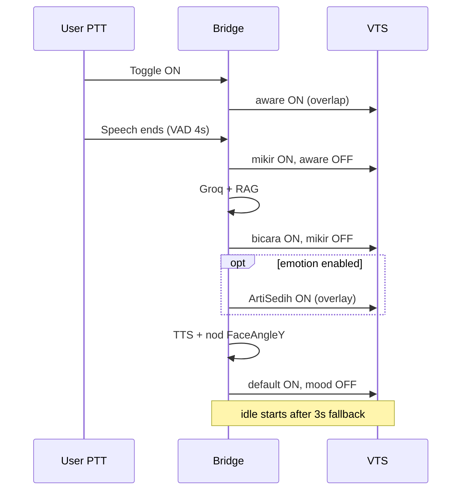

# Handoff Lengkap — Hermes VTuber Bridge (Arti)
**Untuk:** Composer 2.5 / Cursor account lain  
**Tanggal:** 2026-06-16  
**Repo:** `C:\Users\<user>\Documents\hermes-vtuber-host`  
**User:** Bohan (bahasa Indonesia OK)

---

## 1. Ringkasan eksekutif

Proyek ini adalah **bridge Python** antara:
- **VTube Studio** (Live2D model Arti, folder `A_vts`)
- **Groq/Gemini** LLM + Whisper ASR
- **TTS** (Supertone / Edge)
- **PTT toggle** (mouse/keyboard), YouTube chat, idle motion

**Baseline stabil terakhir (di-commit + tag):** `v0.5.8-stable`  
→ Vault RAG hygiene + shutdown reindex, YT idle→nod fix, ASR 10s, Supertonic prewarm, OpenRouter summarizer.

**Rollback aman:**
```powershell
git reset --hard v0.5.8-stable
```
Core expression stabil sejak `v0.5.6-stable` (`d0c2cab`).

**Setelah v0.5.6 (termasuk v0.5.8):**
- Emotion overlay di-wire + `expression_emotion_enabled: True`
- PTT pause tolerance `asr_ptt_silence_tail_sec: 10.0`
- Script patch emotion mouth-free
- Perubahan di `arti_expression_runtime.py`, `hermes_vtuber_bridge.py`, `tests/test_expression_runtime.py`

**Rollback aman ke core stabil:**
```powershell
git reset --hard v0.5.6-stable
```
Lalu restore CONFIG emotion ke `False` jika perlu.

---

## 2. Jalankan & lingkungan

```powershell
cd "C:\Users\<user>\Documents\hermes-vtuber-host"
.\venv\Scripts\Activate.ps1
python hermes_vtuber_bridge.py
```

**Prasyarat:**
- VTube Studio jalan, API enabled, port **8002** (`CONFIG["vts_api_port"]`)
- Model Live2D: `C:\Program Files (x86)\Steam\steamapps\common\VTube Studio\VTube Studio_Data\StreamingAssets\Live2DModels\A_vts`
- Mic ASR: set `asr_input_device` di CONFIG kalau bukan default (hindari Stereo Mix)
- API keys: `.env` atau env vars — **jangan commit keys** (ada placeholder di CONFIG; rotate jika pernah terexpose)

**Test unit (cepat):**
```powershell
python -m pytest tests/test_expression_runtime.py tests/test_arti_wake.py -q
```

**Smoke test emotion:** `docs/SMOKE-TEST-emotion.md`  
**Spec emotion:** `docs/SPEC-arti-emotion.md`

---

## 3. Tag & sejarah versi (expression)

| Tag | Commit | Isi utama |
|-----|--------|-----------|
| `v0.5.3-stable` | `429637e` | Nod + idle ws mirror, single idle worker |
| `v0.5.4-stable` | `3f30405` | Aware on PTT trigger + `IdleMotionStop` hotkey |
| `v0.5.6-stable` | `d0c2cab` | Titik3/lampu stabil, overlap transisi, VTS reader loop, lamp fallback cancel |
| `v0.5.8-stable` | `7f42a34` | Vault health scripts, RAG reindex on shutdown, YT turn sequence, ASR 10s, Supertonic prewarm |

**Tidak ada `v0.5.5` / `v0.5.7`** — loncat sesuai milestone internal.

---

## 4. Alur PTT (push-to-talk) — baca ini dulu

```
Toggle ON  → _ptt_attention_pause() → stop idle + IdleMotionStop (expression di main loop)
User bicara → ASR VAD (diam 10s PTT / 2s wake) → transcribe → queue_voice_trigger
Brain loop → aware (YT) → mikir → RAG → Groq → bicara (+ nod + optional mood) → default → idle (delayed 3s)
Toggle OFF / auto-off setelah jawaban
```

**Log yang diharapkan per turn:**
```
[Expr] → aware
[Expr] → mikir
Arti menjawab: "..."
[Expr] mood: sedih          # hanya kalau emotion ON + mood terdeteksi
[Expr] → bicara
[Nod] smooth mulai ...
[Expr] → default
```

**Jangan rusak:** urutan overlap di `trigger_expression_state` (lihat §6).

---

## 5. Model Live2D — parameter kritis (MO.cdi3.json)

| Label di VTS UI | Param ID | Peran |
|-----------------|----------|--------|
| **1** | `Param28` | Frame garis scribbly #1 |
| **2** | `Param29` | Frame scribbly #2 — **JANGAN masukkan ke exp files** (bikin model hilang/revolve) |
| **3** | `Param33` | Frame scribbly #3 |
| **特殊部件 / Special parts** | `Param130` | 0=normal, 1=titik-3 mikir, 2=lampu bicara |

### Scribble lock (SEMUA .exp3.json di A_vts)

Di file exp, blend **Add**:
- `Param28` = **1.0** → UI "1" = 1
- `Param33` = **-1.0** → UI "3" = **0** (bukan 0.0 di JSON!)
- **Tidak ada** `Param29`

**Script batch:** `scripts/patch_scribble_exp.py`  
Jalankan ulang setelah tambah exp baru:
```powershell
python scripts/patch_scribble_exp.py
```

### Kesalahan yang pernah dibuat (jangan ulangi)

| Percobaan | Hasil |
|-----------|--------|
| Inject `Param130` saja (tanpa exp) | Titik3/lampu hilang |
| Toggle full exp mikir+bicara + matiin default/aware | Blip / reset semua parameter |
| Set `Param33 = 0.0` di JSON | UI tetap "3"=1 → ngedobel hitam |
| Tambah `Param29` ke semua exp | Model hilang |
| Pulse OFF→ON + inject scribble runtime | Blip setelah beberapa turn |
| `ArtiSedih` dengan `ParamMouthOpenY=0` | Mulut diam saat TTS |

---

## 6. Sistem ekspresi (kode) — `hermes_vtuber_bridge.py`

### VTSController

- **Reader loop** route response by `requestID` (nod inject tidak merusak recv ekspresi)
- **`_activate_expression(on, *off)`** — ON baru dulu, baru OFF lama (anti-blip)
- **`trigger_expression_state(state)`:**

| state | Aksi |
|-------|------|
| `aware` | ON ArtiAware → OFF mikir, bicara, default |
| `mikir` | ON ArtiMikir → OFF aware, bicara |
| `bicara` | ON ArtiBicara → OFF mikir |
| `default` | ON ArtiDefault1 → OFF mikir, bicara, aware |

**Tidak ada** pulse OFF→ON, **tidak ada** runtime inject Param28/33 (sudah di exp files).

### File exp utama (di folder VTS `A_vts`)

| File | Fungsi |
|------|--------|
| `ArtiAware.exp3.json` | Alis aware saat PTT listen |
| `ArtiMikir.exp3.json` | Param130=1 titik tiga |
| `ArtiBicara.exp3.json` | Param130=2 lampu |
| `ArtiDefault1.exp3.json` | Wajah normal |
| `ArtiIdle1`…`ArtiIdle50` | Pose idle (FaceAngle di inject idle ws) |
| `ArtiNganggukAtas/Bawah` | Hanya untuk nod mode toggle (legacy); smooth nod pakai inject |
| `ArtiSedih/Marah/Bingung` | Mood overlay |
| `ArtiSenyum` | Ada di `templates/` — **belum di VTS** saat handoff; copy kalau perlu |

### Idle

- Worker thread persisten (`idle_animation_worker`)
- `stop_idle_animation()` saat brain busy / TTS / aware
- `start_idle_animation()` setelah jawaban (+3s via `_schedule_post_answer_cleanup`)
- Idle pakai **websocket kedua** (`_idle_ws`) untuk motion hotkey + FaceAngle inject
- `_idle_paused()` cek `_brain_busy` + `tts_is_playing`

### Lamp fallback

- Satu task tertunda 3s setelah jawaban
- Dibatalkan saat PTT ON / toggle OFF / turn baru (`_cancel_lamp_fallback`)
- Panggil `apply_turn_end` bukan raw default

---

## 7. Sistem emotion — `arti_expression_runtime.py`

**CONFIG:** `expression_emotion_enabled` (saat handoff: **True** — user sedang tes)

| Fungsi | Peran |
|--------|--------|
| `emotion_prompt_for_system` | Tambah instruksi `[EMOTION:...]` ke system prompt |
| `parse_reply_emotion` | Strip tag dari jawaban LLM |
| `resolve_turn_emotion` | Fallback dari kata kunci user ("muka sedih" → sedih) |
| `apply_speaking` | `bicara` + ON mood exp |
| `apply_turn_end` | `default` + OFF semua mood |

**EMOTION_MAP:**
```python
senang → ArtiSenyum.exp3.json
sedih  → ArtiSedih.exp3.json
marah  → ArtiMarah.exp3.json
bingung → ArtiBingung.exp3.json
```

### Mulut harus gerak saat bicara

Mood exp **tidak boleh** lock `ParamMouthOpenY` / `ParamMouthForm`.  
**Script:** `scripts/patch_emotion_mouth_free.py` — sudah dijalankan untuk Sedih/Marah/Bingung di VTS.

**Tidak perlu** bikin `ArtiSedihNganggukAtas` — nod terpisah via `FaceAngleY` inject (`arti_nod.py`).

### Rollback emotion saja

```python
"expression_emotion_enabled": False,
```

Perilaku kembali ke v0.5.6 (bicara/default saja, tanpa mood overlay).

---

## 8. Nod — `arti_nod.py`

```python
"expression_nod_enabled": True,
"expression_nod_smooth": True,      # inject FaceAngleY sine (default)
"expression_nod_period_sec": 0.85,
"expression_nod_fps": 12,
```

- Smooth mode: tidak toggle `ArtiNganggukAtas/Bawah`
- `nod_scope["active"]` true selama seluruh TTS (termasuk synth wait)
- Mirror `FaceAngleY` ke idle ws queue

---

## 9. ASR / PTT timing

```python
"asr_silence_tail_sec": 2.0,        # wake word mode
"asr_ptt_silence_tail_sec": 10.0,    # PTT — tunggu diam sebelum transcribe (pause tolerance)
"trigger_mode": "push_to_talk",     # cek CONFIG aktual
```

**Gejala:** kalimat kepotong di tengah ("kalau kamu suka" saja) → default sekarang **10.0s**; turunkan ke 6–8 kalau terlalu lambat respon.

Log: `vad_tail=10000ms` = 10 detik aktif. Contoh: `[ASR] Selesai bicara (12.3s audio, vad_tail=10s). Mentranskrip...`

**Tes:** restart bridge, PTT ON, ucapkan kalimat panjang dengan jeda 5–8 detik di tengah — harusnya tidak kepotong.

**Echo suppress:** 3 detik setelah TTS selesai, ASR PTT di-skip.

---

## 10. CONFIG flags penting (ekspresi & stabilitas)

```python
"expression_nod_enabled": True,
"expression_emotion_enabled": True,   # False = v0.5.6 murni
"idle_motion_stop_hotkey": "IdleMotionStop",
"asr_ptt_silence_tail_sec": 10.0,
```

**Jangan re-enable tanpa tes:**
- Expression fade (pernah bikin blink/stuck aware) — reverted
- Inject Param130 runtime — killed titik3/lampu
- Pulse OFF→ON pada mikir/bicara — blip
- Param29 di exp files — model hilang

---

## 11. Struktur file kunci

```
hermes_vtuber_bridge.py    # Main orchestrator (~4500 baris)
arti_expression_runtime.py # Emotion parse + apply_speaking/end
arti_nod.py                # Nod saat TTS
arti_voice_pipeline.py     # RAG + prompt assembly
arti_wake.py               # is_arti_wake_call (filter "berarti")
templates/*.exp3.json      # Template exp (copy ke A_vts)
scripts/patch_scribble_exp.py
scripts/patch_emotion_mouth_free.py
docs/SMOKE-TEST-emotion.md
docs/SPEC-arti-emotion.md
templates/PARAMETER_MAPPING.md
vault/                     # Memory RAG, session logs
```

**VTS model path (hardcoded di idle track):**
`...\Live2DModels\A_vts`

---

## 12. Git status (saat handoff)

**Tagged:** `v0.5.6-stable` @ `d0c2cab`

**Modified belum commit:**
- `hermes_vtuber_bridge.py` — emotion wire, PTT 4s, apply_turn_end
- `arti_expression_runtime.py` — resolve_turn_emotion, apply_turn_end order
- `tests/test_expression_runtime.py`
- `templates/ArtiSenyum.exp3.json`
- Runtime state: `ARTI_MOOD_STATE.json`, `ARTI_VIEWERS.md`, `vault/...`

**Untracked:**
- `scripts/patch_emotion_mouth_free.py`
- `scripts/patch_scribble_exp.py` (patch_scribble ada di commit v0.5.6)
- `vault/sessions/`, `archive/...`

**User rule:** jangan commit kecuali diminta explicit.

---

## 13. Checklist verifikasi untuk agent baru

### Tier 0 — Stabil (wajib sebelum eksperimen)

- [ ] PTT 3–5x: titik3 saat mikir, lampu saat bicara, tanpa blip besar
- [ ] `git reset --hard v0.5.6-stable` + emotion False = sama dengan stabil
- [ ] Idle resume setelah jawaban (bukan saat masih bicara)
- [ ] `berarti` tidak trigger wake (`tests/test_arti_wake.py`)

### Tier 1 — Emotion (kalau `expression_emotion_enabled: True`)

- [ ] Log `[Expr] mood: sedih` saat user minta muka sedih
- [ ] TTS tidak mengucapkan `[EMOTION:...]`
- [ ] Mulut gerak saat bicara (mouth params removed dari mood exp)
- [ ] `ArtiSenyum` ada di VTS kalau tes senang
- [ ] Setelah turn: default, mood OFF

### Tier 2 — PTT

- [ ] Pause bicara ~3s tidak memotong kalimat
- [ ] `vad_tail` di latency line sesuai CONFIG

---

## 14. Masalah terbuka / next steps

1. **Commit post-v0.5.6** — emotion + PTT 4s + mouth patch (minta user dulu)
2. **`ArtiSenyum.exp3.json`** — copy ke `A_vts` + patch scribble + mouth-free
3. **Emotion visual** — user tes live; LLM kadang lupa tag (ada `resolve_turn_emotion` fallback)
4. **YouTube chat** — log sering `Gagal ambil token` (issue terpisah)
5. **PTT pause** — user bilang 4s "ga terasa" — bisa coba 5.0
6. **Smooth motion transitions** idle — dibahas, belum implement (user pause untuk stable)
7. **tag `v0.5.7-stable`** — setelah emotion verified + commit

---

## 15. Preferensi user

- Bahasa Indonesia OK
- **Sangat sensitif** ke regresi blip ekspresi — jangan reset semua param
- Stable dulu sebelum eksperimen
- Jangan commit/push kecuali diminta
- Scribble frame: UI "1"=1, "3"=0, **jangan sentuh "2"**
- Ekspresi mikir/bicara = file exp (Param130), bukan inject saja

---

## 16. Diagram alur ekspresi (PTT turn)



---

## 17. Dokumen handoff lama

- `docs/handoff/HANDOFF.md` — fase 0–4 umum
- `docs/handoff/FASE-*.md` — detail per fase
- `.hermes/plans/` — roadmap agent (jika ada)

**Dokumen ini** = source of truth untuk **session Jun 2026 expression/emotion stabil**.

---

## 18. Kontak konteks

Transcript session panjang: agent transcript `f4ed863e-7d2c-40e6-97f5-9b800d33f3ef` (Cursor projects folder).

Vault learnings: `vault/concepts/arti_live_learnings.md` (banyak noise session log — baca dengan saring).

---

*End of handoff — update file ini setelah commit/tag berikutnya.*
